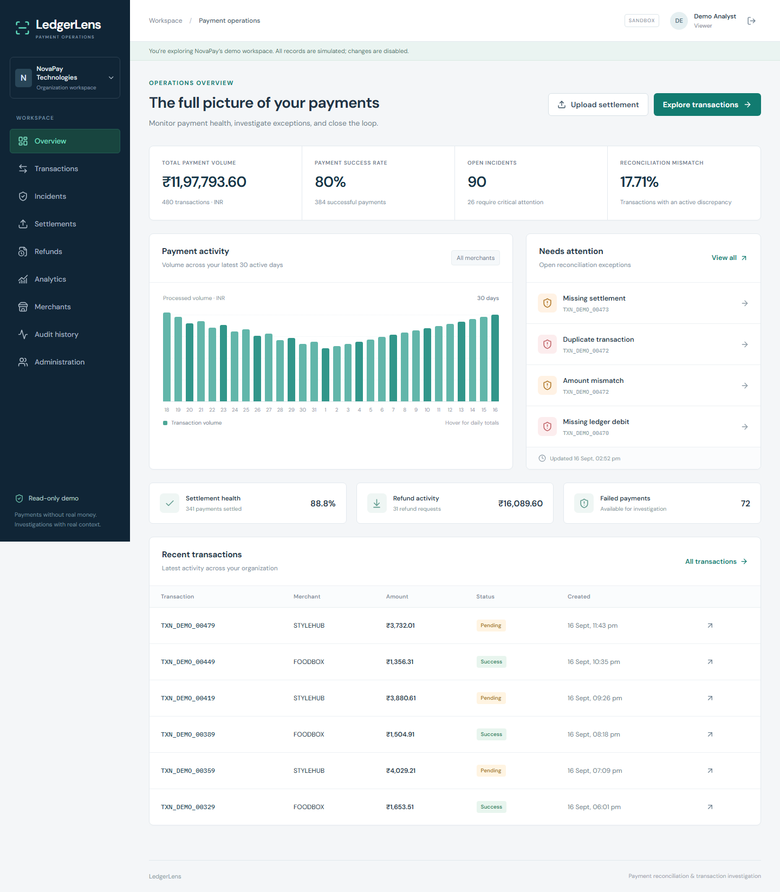
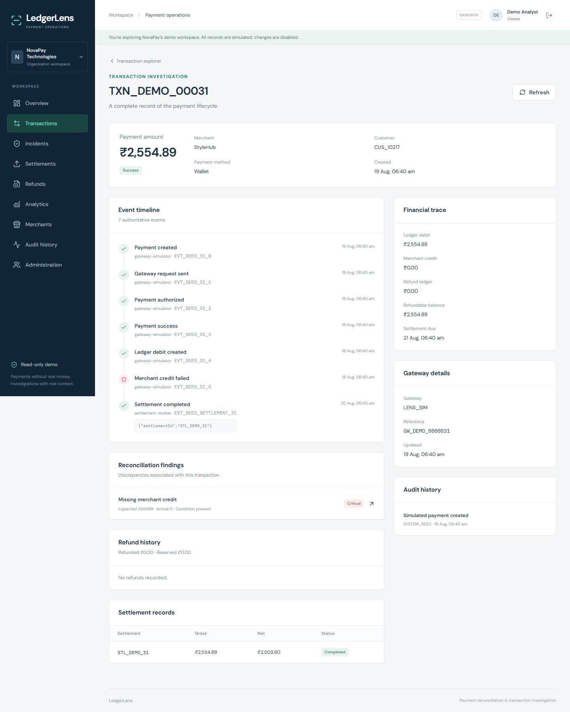
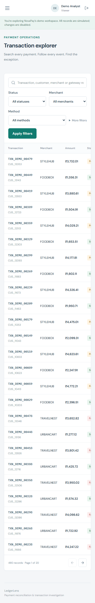
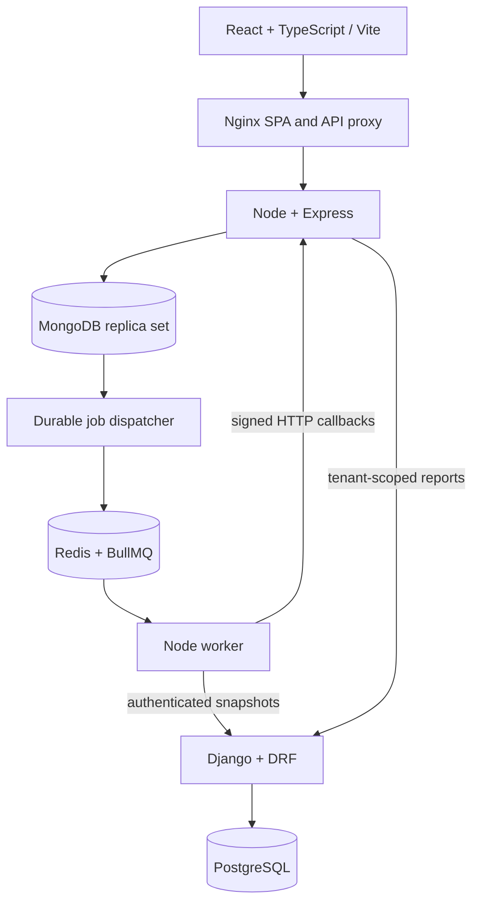

# LedgerLens

### Payment Reconciliation & Transaction Investigation Platform

[](https://github.com/Yosshmi/ledgerlens-payment-reconciliation/actions/workflows/ci.yml)

LedgerLens helps payment operations teams trace transactions, detect settlement and
refund discrepancies, and record investigation decisions in one workspace. This
full-stack portfolio project models those workflows using synthetic payment data.

**React · TypeScript · Node.js / Express · Django REST Framework · PostgreSQL · MongoDB · Redis / BullMQ · Docker**

**Project status:** runs locally with Docker Compose; the complete container stack
is tested in GitHub Actions. There is currently no hosted demo.

[Screenshots](#screenshots) · [Run locally](#local-development-and-demo-access) ·
[Architecture](#architecture-and-stack) · [Tests](#testing) ·
[Documentation](#api-and-documentation)

## At a glance

- **480 seeded payments across four merchants**, including intentional discrepancies
  for investigation.
- **Eight reconciliation rules** comparing payment, settlement, refund and simulated
  ledger evidence.
- **Retry-safe financial workflows:** atomic refund reservations, idempotency keys,
  signed webhooks and durable background-job dispatch.
- **31 automated tests:** 19 Node tests, 9 Django tests and 3 browser/full-stack tests.
- **Five access roles**, tenant-scoped data, audit history and a read-only demo workspace.

## Screenshots

Captured from the running application with backend-derived synthetic data.



<details>
<summary>Transaction investigation and mobile explorer</summary>





</details>

## Problem statement

A successful gateway payment can still have a missing merchant credit, absent
settlement or inconsistent refund evidence. LedgerLens connects the complete
lifecycle, compares independent records and preserves investigation history.

## Example investigation

1. Review the dashboard for payment outcomes and open reconciliation incidents.
2. Filter the transaction explorer by merchant, status, date or amount.
3. Open a transaction to compare its event timeline, financial trace, refunds and
   settlement evidence.
4. Inspect the associated discrepancy, then assign, annotate or resolve the incident
   with an authorized account. The shared demo workspace is read-only.

The simulator and seeded anomalies make these workflows reproducible without a
payment-provider account or real customer data.

## Features

- Revocable cookie authentication, five roles, tenant isolation and read-only demo access.
- Database-filtered transaction search, status/merchant/method/date/amount filters,
  sorting and pagination.
- Investigation pages combining event timeline, financial trace, refunds, settlement
  records, reconciliation findings and audit history.
- Full/partial refunds with atomic reservations, unique idempotency keys and fingerprints.
- Deterministic payment simulation: success, failure and timeout outcomes.
- HMAC-signed callbacks, replay-window checks, duplicate protection and terminal-state guards.
- Asynchronous CSV uploads, GridFS storage, bounded streaming validation, batch
  upserts, progress, retry state and durable queue dispatch.
- Eight reconciliation rules, incident assignment/notes/disposition and activity history.
- Actual-data analytics, merchant/member administration and operational audit records.
- Seeded NovaPay workspace: 480 synthetic payments and four merchants, with intentional anomalies.

## Architecture and stack



Express owns operations and authorization; MongoDB stores flexible payment/event
records and transactional financial updates. BullMQ handles retryable background
work. Django owns reconciliation, incidents and reporting in PostgreSQL, without
duplicating payment CRUD. Docker Compose wires seven services; GitHub Actions tests them.

See [architecture](docs/architecture.md) and [decisions](docs/engineering-decisions.md).

## Local development and demo access

Prerequisites: Git, Node.js 24, Docker Engine/Desktop and Docker Compose.

```sh
git clone https://github.com/Yosshmi/ledgerlens-payment-reconciliation.git
cd ledgerlens-payment-reconciliation
node scripts/init-env.mjs
docker compose up --build -d --wait
docker compose exec -T server node server/dist/seed.js
```

Open [localhost:8080](http://localhost:8080) and select **Open demo workspace**.
The worker populates analytics after the seed reconciliation job completes.
The public demo identity is `demo@ledgerlens.dev`; no shared password is needed.

Private local administrator: `admin@ledgerlens.dev`, with the generated
`DEMO_PASSWORD` in your ignored `.env`. Never publish that password.

```sh
docker compose logs -f worker
docker compose ps
docker compose down
```

Named volumes survive `down`. Do not use `down -v` on data you need. Reseeding
preserves records and requeues reconciliation. A Windows-only preview fallback is
documented in [deployment](docs/deployment.md); it is not a production topology.

## Testing

```sh
npm ci
npm run typecheck
npm run lint
npm test
npm run build
```

Node tests start a disposable real MongoDB replica set; the first run downloads a
MongoDB binary. Optional `TEST_MONGODB_URI` must name a dedicated database ending in
`_test`; tests delete that test database.

For Django, create/activate a virtual environment, install
`reconciliation-service/requirements.txt`, and set `DJANGO_SECRET_KEY`,
`INTERNAL_SERVICE_SECRET` and `DATABASE_URL` before running:

```sh
cd reconciliation-service
python manage.py migrate
python manage.py test tests
ruff check .
```

Use PostgreSQL for normal development. SQLite is only a local test/preview fallback.
Against a disposable running Compose stack, use:

```sh
npx playwright install chromium
# POSIX syntax; set variables equivalently in PowerShell:
BASE_URL=http://localhost:8080 FULL_STACK=true npx playwright test
```

The full-stack test creates synthetic records and updates an incident. Without
`FULL_STACK`, only read-only browser journeys run.

Verified coverage: **19 Node tests**, **9 Django tests against PostgreSQL**, and
**3 browser/full-stack tests**. Coverage includes concurrent refunds, cross-tenant
access, signed duplicate webhooks, settlement replay, desktop/mobile investigation
and actual Redis/worker processing. No load-test or performance claims are made.

## Transaction lifecycle, idempotency and webhooks

```text
Payment + events + job → durable outbox → BullMQ → simulated gateway
→ signed HTTP webhook → atomic payment/ledger/event/audit update
→ reconciliation job → Django projection → incidents and analytics
```

Refunds reserve funds in the same transaction that creates the refund, event, audit
and job. A unique tenant/key pair and fingerprint handle retries; a conditional
balance update prevents different requests overspending. Success converts the
reservation to refunded funds; failure releases it. Money remains integer paise.

Callbacks verify HMAC-SHA256 over timestamp and raw body, enforce a five-minute
window, and deduplicate event IDs. Late callbacks cannot reverse terminal outcomes.

## Reconciliation and background jobs

Pure Python rules detect missing settlement, gross amount mismatch, missing ledger
debit, missing merchant credit, duplicate rows, refund ledger mismatch, refund amount
mismatch and settlement status mismatch. Missing settlements respect a due time;
legitimate fees do not cause false gross-amount mismatches. Unique incidents retain
analyst decisions across repeated runs.

The MongoDB outbox survives Redis outages. BullMQ retries five times with exponential
backoff. Stable callback/row IDs tolerate replay. CSV validation uses two streamed
passes and 250-row batches. Periodic sweeps refresh overdue conditions.

## Configuration and security

`.env.example` documents database URLs, application/service secrets, allowed origin,
worker callback URL and demo settings. `scripts/init-env.mjs` generates local secrets.
`PUBLIC_HOST` supplies the real hostname for the HTTPS deployment overlay.

Tokens use HttpOnly/SameSite cookies, server-side revocation and Secure cookies in
production. Mutations require Origin + CSRF checks; roles and tenant scope are enforced
in the backend. Uploads, JSON and monetary values are runtime validated. Logs omit
credentials; errors do not expose stacks. See [security](docs/security.md).

## API and documentation

Main routes: `/api/auth`, `/api/transactions`, `/api/refunds`, `/api/settlements`,
`/api/jobs`, `/api/incidents`, `/api/analytics`, `/api/merchants`, `/api/users`, `/api/audit`.

- [API contracts and CSV format](docs/api.md)
- [Database design and indexes](docs/database-design.md)
- [Deployment runbook](docs/deployment.md)
- [Engineering decisions and trade-offs](docs/engineering-decisions.md)
- [Development log](docs/development-log.md)
- [Engineering review](docs/review.md)
- [Notes preserved for later study](docs/interview-notes.md)

## Deployment status

The application is available as a local Docker Compose demo. An optional HTTPS
deployment configuration using Caddy is included in
[`deploy/compose.production.yml`](deploy/compose.production.yml), with setup steps
in the [deployment runbook](docs/deployment.md). Its Compose configuration has been
validated; public hosting and production smoke tests have not been completed.

## Deliberate limits and future improvements

- Payments use INR and a simulated gateway; ledger entries represent financial
  evidence rather than a complete double-entry accounting system.
- Background processing supports one worker, and reporting updates asynchronously.
- The shared demo is read-only; transaction lists use bounded offset pagination,
  and each settlement CSV covers one merchant.
- Production load testing, real payment-provider integration and SSO/MFA are outside
  the current scope.

Future work: keyset pagination, indexed text search, stronger projection ordering,
shared rate limits, upload retention, automated backup/restore and operational alerts,
guided by measured usage rather than technology count.
