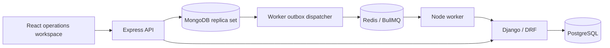

# Architecture

Express is the only browser API. Authentication supplies the organization and actor;
client-provided tenant or actor fields are never trusted. Django is private and accepts
authenticated internal calls, with tenant context supplied by Express or the worker.

Operational mutations use MongoDB transactions (a replica set is required). Jobs are
written in the same transaction as financial mutations, then dispatched to BullMQ.
This durable outbox avoids losing work when Redis is unavailable. Retried jobs must
be idempotent. PostgreSQL stores analytical projections and incidents, not a second
operational source of truth.

The public demo is a read-only tenant. A private local admin can exercise mutations.
The gateway is simulated and never moves real money.
